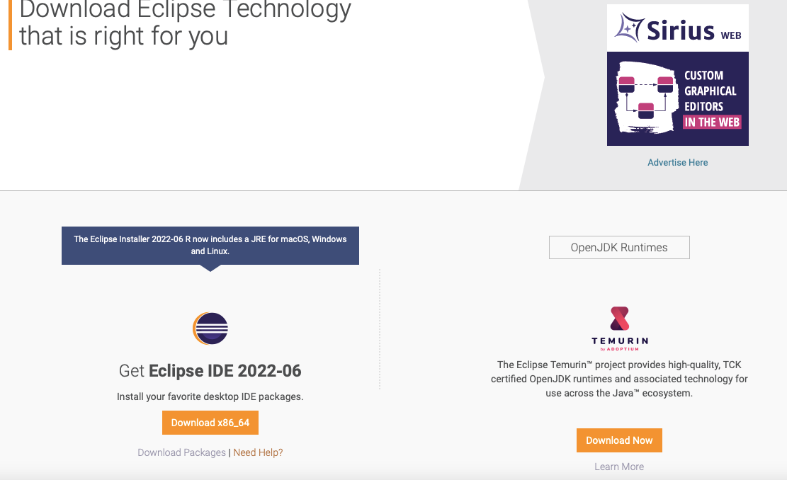

# Setup Eclipse 

 1. Download [Eclipse](https://www.eclipse.org/downloads/)

2. Open installer and follow to steps: 

 * Unzip file
 * Select a package to install
 * Select a folder to install

 3. Use the Eclipse

