#  Install GIT

  - Open Eclipse
  - Choose project => right click “Team”=> Share project
  - Press button "Create…”
  - Choose folder for local repository =>double push “Finish”
  - Press “Window”=> “Perspective”=> “Customize perspective"
  - Move to bookmark Action Set Aviailiability” => Click to “Git” and “Navigation Git”
  - Check what happened. Add Git to a work space:
  
  1. Open Window => show view => other…
  2. Click on “Git repository”, "Git Staging” and Version Control (Team) => History
  
  - Go to menu “Git” => Commit
  OR
  - Choose project => right click =>Team => Commit
  - Choose needed files and move to “Staged Changes”
  - In field for description add some text:
  
  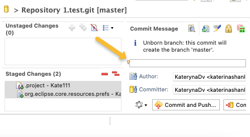
  
  and press “Commit“
  
  - On the left side you can see status of repository:
  
  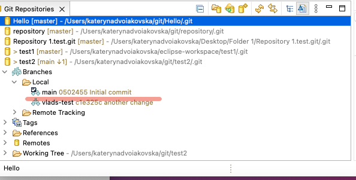
  - On the left side click (right button)“Remotes” and “Create Remote”
  
  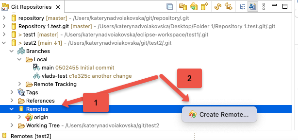
  - Add remote name and push Create:
  
  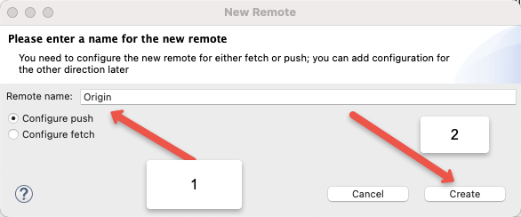
  - Displayed new window, click “Change”
  
  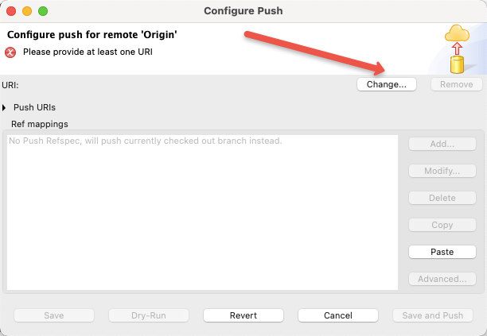
  
  *Copy your GitHub repository address 
  
  - Displayed window with address repository, add user name and password => click Finish
  
   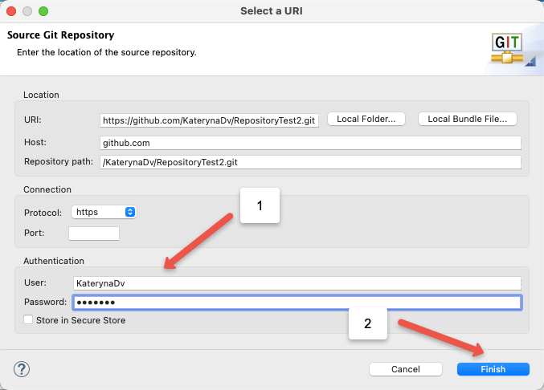
  - In a previous window click Advanced
  
  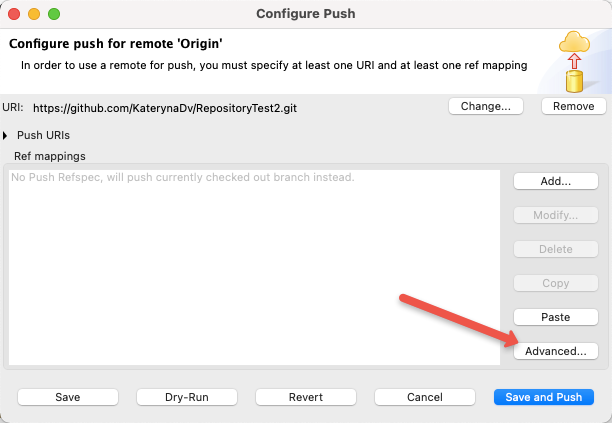
  - Select “Source led”: Main/branch
  
  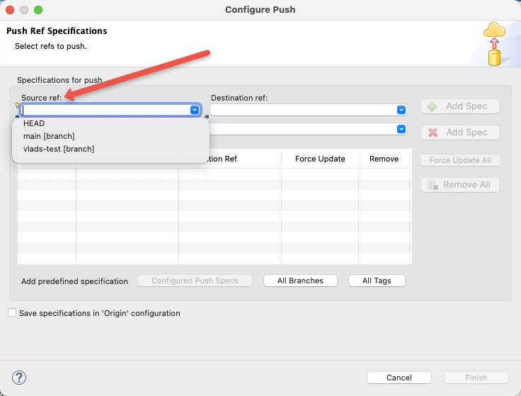
  - Click “Add spec” => pic “Save specifications in “Origin” configuration => Finish
  
  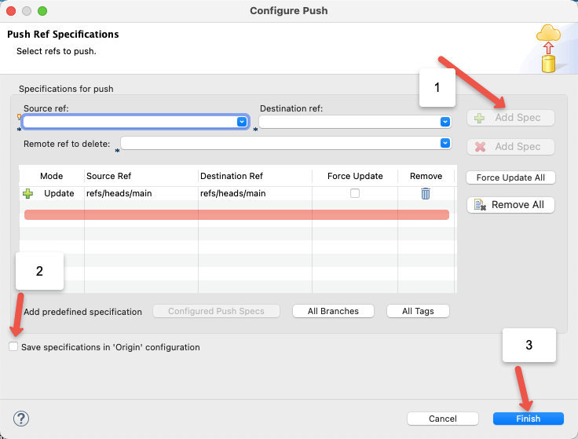
  - Click “Save”
  
  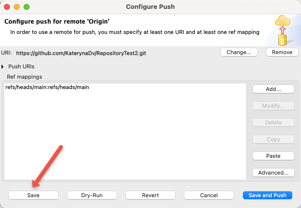
  - Select 2th Git catalogue (step 1) and push button “Push current branch”(step 2):
  
   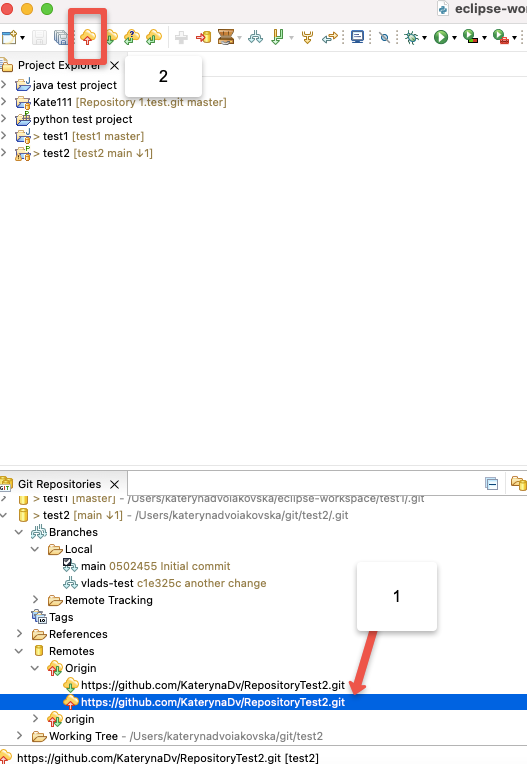
  
